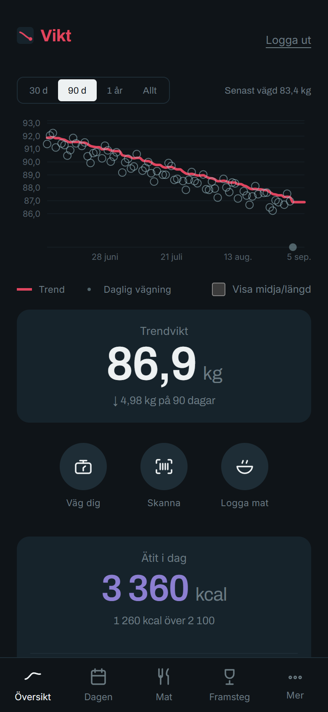
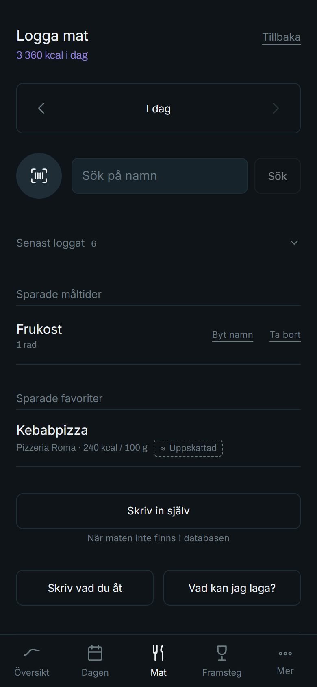
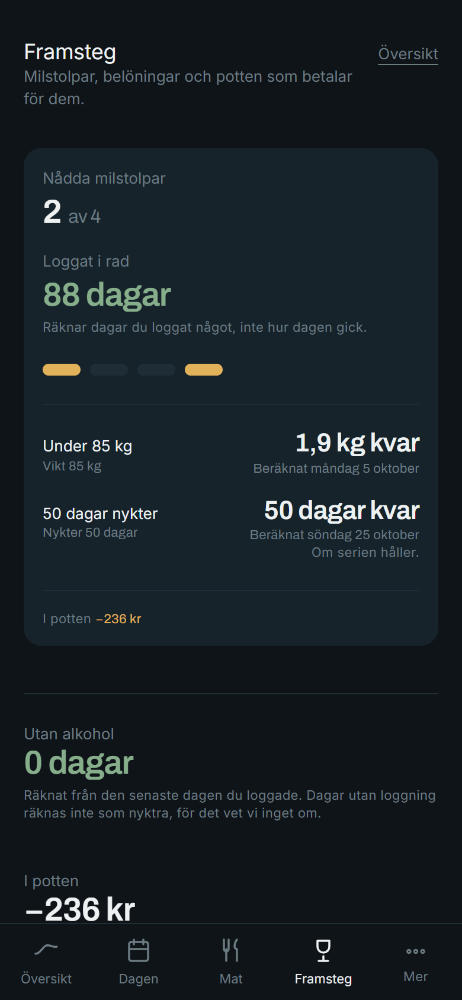

# Vikt

**Gör det lättare.**

A self-hosted weight and habit tracker. It shows a smoothed trend line instead
of this morning's number, and it works out what you burn from your own logged
data instead of a formula.

Swedish interface. AGPL-3.0. Runs on one small server.

<p align="center">
  
  
  
</p>

## The thesis

Two ideas, and everything else follows from them.

**A daily weight is mostly noise.** Body weight swings a kilo overnight on salt,
sleep and water, so a number that moves the wrong way says almost nothing about
the week. Vikt stores every reading and draws a 10-day exponentially smoothed
trend through them, Hacker's Diet style. The raw readings stay visible as faint
points behind the line, because hiding them would be pretending the noise is not
there — but the line is what the app is about, and it gets the hero position on
every screen.

**Your maintenance level is measurable, not calculable.** The usual approach
takes your height, weight, age and a guessed activity multiplier and produces a
number that is wrong for you specifically. Vikt instead back-calculates it: over
a rolling 28-day window it takes what you actually ate and what the trend
actually did, and solves for the only figure that explains both. Mifflin-St Jeor
is the fallback for the first fortnight, and the app says which one you are
looking at and how confident it is.

Both of those live in `packages/shared/src/calc/`, are pure functions, and are
covered by tests that check the two projections — "on plan" and "at current
pace" — agree when they should. `CLAUDE.md` §4 specifies the arithmetic exactly.

## What it does

- **Weight**, with the trend line, waist-to-height on the same axis, and
  projections to a goal by two independent routes shown side by side.
- **Food**, by barcode, by name against Open Food Facts and Livsmedelsverket, by
  describing a meal in a sentence, or by typing an estimate for the pizzeria
  down the road. Portions resolve through what you logged last time, your own
  definitions, and a table of Swedish household measures.
- **The day**: energy, mood, sleep, steps, alcohol, activity, measurements.
- **Milestones and a savings pot** for the things you did not buy.
- **Offline**. Everything you log is written locally first and syncs when the
  network comes back, so a meal logged in a shop basement is logged.
- **An optional local LLM layer** for parsing meals and suggesting recipes,
  which degrades to manual entry when the machine running it is off. It never
  produces a calorie figure: it names foods, and the database prices them.

Two rules the whole app is built on: **there is no failure state** — a missed day
renders as a gap, never as red — and **absent is not zero**. A day nobody logged
is unknown, and the app says "inte än" rather than inventing a number.

## Running it locally

```sh
pnpm install
cp infra/.env.example .env          # then edit it, see below
pnpm dev:db                         # Postgres 16 in Docker, nothing else
pnpm --filter api db:migrate        # apply the checked-in migrations
pnpm --filter api invite            # mint an invite code and print it
pnpm dev                            # API on 127.0.0.1:3000, Vite on 0.0.0.0:5173
```

The landing page is at <http://localhost:5173/> and the app at
<http://localhost:5173/app>. From a phone on the same network, use the LAN
address Vite prints: the phone talks to Vite, which proxies `/api` to the API on
loopback. The API is never bound to the LAN, not even in development.

Editing `.env`, at minimum:

- `SESSION_SECRET` — `openssl rand -hex 32`. The process refuses to start while
  this is missing, short, or still the example value.
- `POSTGRES_PASSWORD` and the matching password in `DATABASE_URL`.
- `COOKIE_SECURE=false` for plain HTTP on the LAN. Keep it `true` anywhere
  reachable from the internet.
- `SEED_PASSWORD`, if you want `pnpm --filter api seed:dev` to create the shared
  development account. There is deliberately no default.

Optional:

- `PUBLIC_BASE_URL` is where this installation is reachable, as an absolute URL.
  **Every link in every email is built from it** (D109). Without it a link would
  be relative, which is fine in a page and useless in an inbox: no mail client
  has a base to resolve it against, and that is exactly how an invite once went
  out with a dead link in it. `assertProdSecrets` refuses a value that is not
  absolute, and `PUBLIC_ORIGIN` is still read as a fallback.
- SMTP is configured in the app, under Administration, Mejlserver (D102). The
  `SMTP_*` variables are read once, on first boot, and imported into the
  encrypted settings.
  **Leave them empty and everything still works**: reset says it cannot send,
  and approving an invite shows you the code to pass on by hand.
- `OLLAMA_URL` enables the LLM layer. Empty means off, and the controls that
  depend on it are simply not rendered.

## Checks

```sh
pnpm typecheck
pnpm lint          # includes the multi-user isolation rule, see D15
pnpm test
pnpm --filter api contract:food   # hits the live food APIs; needs the network
```

The first two also run as a pre-commit hook, installed by `pnpm install`. All of
them except `contract:food` run in GitHub Actions on every push and pull request,
which is what STATE.md's verification line cites: a claim that the tree is clean
is worth what has actually been run, and it once said so while `HEAD` had 27 lint
errors (D98).

## Self-hosting

```sh
cd infra
cp .env.example .env    # real secrets; DATABASE_URL host is `postgres`
docker compose up -d --build
```

Postgres, the API and nginx. Migrations run from the API container's entrypoint.
Only nginx publishes a port, and only to `127.0.0.1:8080` on the Docker host,
where a reverse proxy terminates TLS in front of it. See D12.

Set `TRUST_PROXY` to the **address or CIDR of the immediate peer**, not a hop
count, and read D14 before you do: getting this wrong lets anyone who can open a
socket to the API claim to be any IP they like.

## Deploying

Two routes, same three containers:

- **`infra/docker-compose.yml`** builds from source on the machine you are
  standing at: `cd infra && cp .env.example .env && $EDITOR .env && docker
  compose up -d --build`.
- **`infra/docker-compose.portainer.yml`** pulls prebuilt images from a
  registry, for a host with no source tree on it. Everything configurable is a
  stack environment variable, because that is the form a container-management UI
  gives you.

### Deployment modes

Each is off by default, each is an environment variable, and none of them can be
changed from the admin UI: a toggle in a web interface that exposes a public
endpoint is an attack surface, and a self-hoster edits the file once.

| Mode | On means | Off means |
|---|---|---|
| `LANDING_ENABLED` | The public landing page is served at `/`. | `/` redirects to `/app` and the landing bundle is never served. |
| `REQUEST_ENABLED` | The request form is served at `/kod` and the endpoint it posts to is registered. | Both are 404: the path does not exist and neither does the route. |
| `LLM_ENABLED` | The phase 8 surfaces exist. Needs `OLLAMA_URL`. | They are absent, not greyed out. |

**`REQUEST_ENABLED` is separate from `LANDING_ENABLED` on purpose** (D127). A
landing page is something to read. A request form takes a stranger's name and
address, and every code you approve makes you responsible for that person's
weight, meals and address, under your own name on `/integritet`. Those are two
different decisions and the common answer is yes to the first and no to the
second. Nothing links to `/kod` even when it is on: turning it on means handing
the address to somebody, not publishing it. The form keeps its human check, its
honeypot and its rate limit either way.

`CONTACT_EMAIL` is required wherever either of those first two is true:
`/integritet` has to name somebody the reader can write to about their own data,
and the API refuses to boot without it. Whoever deploys Vikt is the controller
under the GDPR, not whoever wrote it, so that address cannot live in this
repository.

`.github/workflows/release.yml` builds and pushes both images on every push to
`main` that touches code.

**The API drains the mail queue itself** (D104). There is nothing to start
alongside it, and a second API instance would run a second drainer and send
everything twice, so **one instance is the supported deployment** until a lock
exists.

`pnpm --filter api mail:worker` still exists for the separate-process
arrangement and refuses to run unless `MAIL_WORKER_IN_PROCESS=false`.

To see what the mail actually looks like in a real client, send one of each
template to yourself:

```sh
pnpm --filter api mail:samples -- --to you@example.com
```

They go through the queue like everything else, so a delivered set proves the
templates, the queue and the drainer together rather than the transport alone.

To make an account an admin — the only way, deliberately:

```sh
pnpm --filter api admin -- --email you@example.com
```

Back up nightly, and check that the backups restore:

```sh
infra/backup.sh                                    # from cron
infra/restore-check.sh /var/backups/vikt/<file>    # safe on the live host
```

See [docs/backup.md](docs/backup.md) for where they go, how long they are kept,
and the step-by-step restore. A backup that has never been restored is a hope.

To rename the app, with no rebuild:

```sh
APP_NAME="Nedåt" docker compose up -d nginx
```

## Layout

```
apps/api/         Fastify. routes/ -> services/ -> repositories/, db/
apps/web/         React 18 + Vite + Tailwind. index.html is the landing page,
                  app/index.html the application
packages/shared/  Zod schemas, shared types, and ALL derived-number math
infra/            compose files, nginx, Dockerfiles, .env.example
eslint-rules/     the multi-user isolation rule
docs/             the graphic profile, the mark, screenshots
```

The math lives in `packages/shared/src/calc/` so the server and the client
compute identical numbers, and everything in it is covered by Vitest.

## The design record

Three documents, and they are the point rather than decoration:

- **[CLAUDE.md](CLAUDE.md)** — the constitution. Non-negotiable rules, the exact
  arithmetic, the visual direction, and the build order.
- **[DECISIONS.md](DECISIONS.md)** — every architectural decision with the
  reasoning and what was rejected. Append-only. Read this before changing
  anything structural; most of the traps have been walked into already and the
  entry explains what happened.
- **[STATE.md](STATE.md)** — where the build has got to, what is open, and the
  measurements from the last pass.

## Licence and data

The code is **AGPL-3.0**. See [LICENSE](LICENSE) and [NOTICE](NOTICE).

Food data cached from **Open Food Facts** is licensed
[ODbL](https://opendatacommons.org/licenses/odbl/1-0/) and is **not part of this
repository**: it is fetched at runtime into a local cache, and nothing derived
from it is committed here. Data from **Livsmedelsverket** is likewise fetched at
runtime.

Vikt is not medical advice. It shows you your own numbers and says how confident
it is about them.
